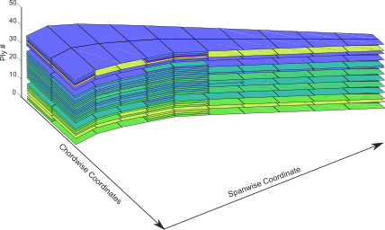
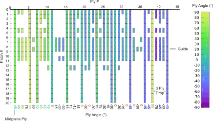

## Contributors

Terence Macquart - Instigator (University of Bristol http://www.bristol.ac.uk/engineering/people/terence-macquart/overview.html)

You can contribute too!

## Opti-BLESS Overview

The **Opti**misation of **BLE**nded **S**tacking **S**equence toolbox (**Opti-BLESS**) is a simple MATLAB toolbox allowing you to optimise patch-based stacking sequences including composite design guidelines. The code is easily accesible to everybody who posseses a basic understanding in classical laminate theory and optimisation. Detailed explanation about how to use the code are provided in the PDF file distributed with the code. Typical outputs obtained for the composite optimisation of an aircraft wing are shown in the figures below.

## Motivation

While the theory of stacking sequence optimisation is rather straightforward, its numerical implementation is something of a challenge and a time consuming task. At present time, only private tools such as [Hypersizer](http://hypersizer.com/) and [OptiStruct](http://www.altairhyperworks.co.uk/product/optistruct) are available for this purpose. The **Opti-BLESS** toolbox will give you a thouroughly validated set of building blocks required for stacking sequence optimisation. You can either use the toolbox as is or improve upon it and even make it yours. I will be more than happy to accept pull requests or contributions from other developers. The ultimate goal of the developing toolbox is to bridge the gap between the numerical and practical design of composite structures. Don't get me wrong, there is still quite some work left to be done in order bridge that gap but this toolbox at least provides a basis to start with. The toolbox current capabilities and possible improvements are discussed below. 

## Capabilities

The **Opti-BLESS** toolbox relies on a direct optimisation approach where explicit design variables such as ply angles, ply insertion and number of plies are used to optimise stacking sequences. The toolbox is a numerical implementation based on the guide-blending strategy which ensures the composite structure continuity over the laminate patches. The toolbox can either be used to optimise composite structures directly or to retrieve stacking sequences matching the structural properties of designs optimised using parametrisation such as stiffness or lamination parameters.  

In addition, the composite design guidelines included within the toolbox algorithm are:

* Symmetry: Stacking sequence is mirrored about the mid-plane.
2. Balance: All fibre angles, except 0 and 90deg, occur in ± pairs. 
3. Damtol: Damage Tolerance,  ±45deg plies are used for the upper and lower laminate plies.
4. Rule10percent: A minimum of 10% of plies in each of the 0, ±45 and 90deg is enforced.
5. Disorientation: The change of angles between two consecutive plies should not exceed 45deg.
6. Contiguity: No more that 'X' plies with same fibre orientation should be next to each other (set by user).
7. DiscreteAngle: Discrete fibre angles are used (set by user).  
8. InernalContinuity: One ply must be kept spanning the entire structure every 'X' plies (set by user).
9. Covering: Covering plies on the lower and upper surfaces of the laminate cannot be dropped. 

## Limitation - Possibility for improvements

* The curse of dimensionality. Despite the concise coding provided by the guide-based approach, the growth of design variables will quickly limit the capability of the genetic algorithm in finding an optimal solution.
* Limited geometrical capabilities. The structure geometry could be used in future release so as to have a more significant influence on the final optimised design. For instance, by considering by drop rates, gap and overlap due to automated fibre placement. 
* Transition section between patches are considered negligible during fitness calculation. Intermediate sections contain all ply drops and are therefore critical parts of the structure, due to stress concentration and trough-thickness load distribution, where failure is likely to start.
* Tow-steering methodologies are not currently considered. I may, however, be possible to exploit the current code in order to create an option for fibre path design. 
* A single material type is used. All plies are made of the materials. This limitation could be easily removed in future release. 
* The addition of detailed manufacturability constraints could further help bridging the gap between optimised and manufacturable designs. 
* Despite the consice coding methodology provided by the guide based approach, current exploration of the design space for highly constrained stacking sequence optimisation remains difficult. New explicit constraint handling could help solve this problem.

## Requirement

- MATLAB 2012 or more recent
- MATLAB Optimisation toolbox (GA)

## Installation

Once you have a suitable working version of MATLAB the toolbox can be run without additional instalations required. If this is your first time uing the toolbox you should start by running the Learn2Use.m examples.

## Tests

The toolbox has been thouroughly validated and is provided with a set of examples and benchmarks. Reaching 100% certainty in terms of validation is, however, impropable and possible errors may still be experienced. In this case, you can fix it and report it or simply provide feedback for me to be able to fix it (terence.macquart@gmail.com). Do not hesitate to aslo propose features you would like to be implemented.     

## License

The **Opti-BLESS** toolbox is distributed under a permisive 2-clause BSD license. You can redistribute and use the code in source and binary forms, with or without modification, provided that the redistributions retain the copyright notice, the list of conditions and the disclaimer. A copy of the license file is also provided with the toolbox for more details.

## Release Update

Release 1.1.0 improves upon the previous version on the following point:

- Ply drops are replaced by ply insertion making easier to generate initial populations
- For sake a clarity the encoded solutions is replaced by its corresponding stacking sequence table in the source code
- Explicit and an implicit constraints for the 10% rule now have been added
- The plot function includes a new scaling inputs
- New learning examples have also been added
- Initial population generations has been greatly changes to increase its speed
